# Crop Disease Classification

A deep learning pipeline to classify plant diseases from leaf images using the PlantVillage dataset. Built with **MobileNetV2 transfer learning** in PyTorch, achieving **97.8% validation accuracy** across 15 disease classes — optimized for mobile deployment in a farmer-facing application.

<p align="center">

| Validation Accuracy | Model Size | Inference Speed | Disease Classes | Crops Covered |
|:---:|:---:|:---:|:---:|:---:|
| **97.83%** | **9.3 MB** | **~9 ms** (GPU) | **15** | **3** (Tomato, Corn, Potato) |

</p>

### System Overview

<p align="center">
  
</p>

> PlantVillage dataset trains a MobileNetV2 model. The PyTorch model serves Streamlit and FastAPI directly. An export script converts it to TFLite for the React Native mobile app.

---

## What's Inside

This project fulfills every requirement from the assignment and extends well beyond with production-grade applications:

| # | Assignment Requirement | Status | Implementation |
|---|------------------------|:------:|----------------|
| **1** | Data Exploration — sample images, class distribution, insights | **Done** | Notebook Part 1: distribution plot, sample grid, 3 dataset insights |
| **2** | Model Building — 10-15 classes, augmentation, validation | **Done** | 15 classes, MobileNetV2, two-phase training, 5 augmentation transforms |
| **3** | Evaluation — confusion matrix, correct/incorrect predictions | **Done** | Notebook Part 3: confusion matrix, 5 correct + 5 incorrect samples |
| **4** | Business Recommendation — model choice for mobile deployment | **Done** | MobileNetV2 vs ResNet50 vs EfficientNet comparison + recommendation |
| **5** | Streamlit App | **Done** | Multi-page app: diagnosis, dashboard, disease library |
| **6** | README — setup, performance table, recommendation | **Done** | This file |
| **7** | Saved Model File | **Done** | `checkpoints/best_model.pth` (9.3 MB) + TFLite export (9.1 MB) |

### Integration

| Extra | What It Adds |
|-------|-------------|
| **REST API** (FastAPI) | Production API with rate limiting, request tracing, OpenAPI docs |
| **Docker Deployment** | Multi-stage build, health checks, one-command `docker compose up` |
| **WhatsApp Bot** (Twilio) | Farmers send leaf photos via WhatsApp — no app install needed |
| **Mobile App** (React Native) | On-device TFLite inference + online mode, full 5-screen app |

---

## Table of Contents

1. [Quick Start](#quick-start)
2. [Running the Notebook](#running-the-notebook)
3. [Project Structure](#project-structure)
4. [Dataset & Approach](#dataset--approach)
5. [Model & Training](#model--training)
6. [Results & Business Recommendation](#results--business-recommendation)
7. [Streamlit App](#streamlit-app)
8. [REST API](#rest-api)
9. [Docker Deployment](#docker-deployment)
10. [WhatsApp Integration](#whatsapp-integration)
11. [Mobile App (React Native)](#mobile-app-react-native)

---

## Quick Start

**Prerequisites**: Python 3.8+ (tested on 3.11), GPU recommended (Apple MPS / NVIDIA CUDA / CPU fallback)

```bash
# 1. Clone and navigate to project
cd crop-prediction

# 2. Install dependencies
pip install -r requirements.txt

# 3. Download dataset (requires Kaggle API key — see below)
kaggle datasets download -d abdallahalidev/plantvillage-dataset
unzip -q plantvillage-dataset.zip -d plantvillage-dataset

# 4. Create data symlink
mkdir -p data/raw
ln -sf "$(pwd)/plantvillage-dataset/plantvillage dataset/color" data/raw/color

# 5. Run the notebook (primary deliverable)
cd notebooks && jupyter notebook crop_disease_classification.ipynb
```

<details>
<summary><b>Kaggle API setup</b> (if you don't have credentials yet)</summary>

1. Go to [kaggle.com/settings](https://www.kaggle.com/settings) and click **"Create New Token"**
2. Save the downloaded `kaggle.json` to `~/.kaggle/kaggle.json`
3. Set permissions: `chmod 600 ~/.kaggle/kaggle.json`

</details>

<details>
<summary><b>Run apps after notebook</b> (Streamlit, API, Docker, Mobile)</summary>

```bash
# 6. Launch the Streamlit demo app
streamlit run streamlit_app/app.py

# 7. Launch the REST API (from project root)
uvicorn api.main:app --reload

# 8. Launch via Docker (alternative to step 7)
cp .env.example .env   # edit with your config
docker compose up --build

# 9. Run the mobile app (React Native)
pip install torch torchvision onnx==1.16.2 onnx2tf tensorflow && python scripts/export_model.py
cd mobile && npm install && cd ios && pod install && cd .. && npx react-native run-ios
```

</details>

---

## Running the Notebook

The Jupyter notebook is the **primary deliverable** — full end-to-end pipeline with inline visualizations and business recommendations. Run all cells sequentially:

| Part | Description | Output |
|------|-------------|--------|
| **Part 1** | Data exploration — class distribution, sample images, insights | `outputs/plots/class_distribution.png` |
| **Part 2** | Model building — augmentation, MobileNetV2, two-phase training | `checkpoints/best_model.pth` |
| **Part 3** | Evaluation — confusion matrix, predictions, business recommendation | `outputs/plots/*.png`, `outputs/metrics/*.json` |
| **Part 4** | Streamlit demo app | `streamlit_app/` |

**Expected runtime**: ~10-15 min (GPU) / ~30-45 min (CPU)

---

## Project Structure


```
crop-prediction/
├── notebooks/crop_disease_classification.ipynb  # Primary deliverable
├── src/                                   # Shared ML pipeline
│   ├── config.py                          # Central config (paths, hyperparameters)
│   ├── data/                              # Data loading & transforms
│   │   ├── transforms.py                  #   Image transform pipelines
│   │   ├── dataset.py                     #   TransformSubset, dataset preparation
│   │   ├── loader.py                      #   DataLoader creation, class counting
│   │   └── disease_info.py                #   Enriched disease data (shared across apps)
│   ├── models/
│   │   └── classifier.py                  #   MobileNetV2 build & layer unfreezing
│   ├── training/
│   │   └── trainer.py                     #   Two-phase training with early stopping
│   ├── evaluation/
│   │   ├── metrics.py                     #   Classification report
│   │   ├── benchmark.py                   #   Inference speed benchmarking
│   │   └── export.py                      #   Save results (JSON, CSV)
│   ├── visualization/
│   │   ├── data_plots.py                  #   Class distribution, sample images
│   │   ├── training_plots.py              #   Training history curves
│   │   └── eval_plots.py                  #   Confusion matrix, per-class accuracy
│   └── inference/
│       ├── predictor.py                   #   DiseasePredictor class (PyTorch)
│       └── tflite_predictor.py            #   TFLitePredictor class (lightweight runtime)
├── streamlit_app/                         # Streamlit demo app
│   ├── app.py                             #   Entry point — multi-page navigation
│   ├── styles.py                          #   Custom CSS design system
│   ├── components.py                      #   Reusable UI: cards, bars, badges, chips
│   └── views/                             #   predict, dashboard, disease_library
├── api/                                   # FastAPI REST API
│   ├── main.py                            #   App entry, lifespan, CORS, middleware
│   ├── config.py                          #   API config (dotenv, CORS, rate limits, Twilio)
│   ├── dependencies.py                    #   Dependency injection
│   ├── exceptions.py                      #   Custom exceptions + handlers
│   ├── schemas/                           #   Pydantic v2 response models
│   ├── routers/                           #   health, prediction, diseases, whatsapp
│   └── services/
│       └── whatsapp_service.py            #   WhatsApp image download & response formatting
├── mobile/                                # React Native mobile app (online + offline)
│   ├── src/screens/                       #   Home, Camera, Result, History, Library
│   ├── src/services/                      #   TFLite classifier, API client, image processor
│   ├── src/context/                       #   Model lifecycle, inference mode
│   └── src/theme/                         #   Design tokens
├── scripts/                               # export_model.py, sync_mobile_assets.py
├── wiki/                                  # execution-guide.md, architecture.md
├── Dockerfile                             # Multi-stage production build
├── docker-compose.yml                     # One-command Docker deployment
├── .env.example                           # Environment variable template
├── checkpoints/best_model.pth             # Saved model weights (9.3 MB)
├── exports/crop_disease_classifier.tflite # TFLite model (9.1 MB)
└── requirements.txt
```

---

## Dataset & Approach

### PlantVillage Dataset

- **Source**: [PlantVillage Dataset](https://www.kaggle.com/datasets/abdallahalidev/plantvillage-dataset) (Kaggle) — ~54,000 images across 38 classes
- **Selected**: 15 classes across 3 crops (22,115 images)
- **Split**: 80% train (17,692) / 20% validation (4,423) — stratified, seed=42

| Crop | Classes | Count |
|------|---------|-------|
| **Tomato** (8) | Bacterial Spot, Early Blight, Late Blight, Leaf Mold, Septoria Leaf Spot, Target Spot, Yellow Leaf Curl, Healthy | 16,111 |
| **Corn** (4) | Common Rust, Gray Leaf Spot, Northern Leaf Blight, Healthy | 3,852 |
| **Potato** (3) | Early Blight, Late Blight, Healthy | 2,152 |

**Class imbalance**: 35.2x ratio (largest: 5,357 / smallest: 152). Mitigated with weighted random sampling + class-weighted CrossEntropyLoss.

### Why MobileNetV2?

Transfer learning on ~22K images avoids overfitting by leveraging ImageNet features. MobileNetV2 was chosen for its mobile deployment profile:

| Criterion | MobileNetV2 | ResNet50 | EfficientNet-B0 |
|-----------|------------|----------|------------------|
| Accuracy | ~97.8% | ~98.5% | ~98.2% |
| Model Size | 9.3 MB | ~97 MB | ~20 MB |
| Parameters | 2.4M | 25.6M | 5.3M |
| Mobile Inference | ~30ms | ~150ms | ~50ms |

MobileNetV2 uses **depthwise separable convolutions** — near-ResNet accuracy at 1/10th the size. Critical for on-device deployment in areas with limited connectivity.

<p align="center">
  
</p>

---

## Model & Training

### Architecture

```
MobileNetV2 (pre-trained on ImageNet)
├── Feature Extractor: 17 inverted residual blocks
│   └── Last 5 blocks unfrozen for fine-tuning (Phase 2)
└── Custom Classifier Head:
    ├── Dropout(0.3)
    ├── Linear(1280 → 128)
    ├── ReLU
    ├── Dropout(0.2)
    └── Linear(128 → 15)
```

**Input**: 224 x 224 x 3 (RGB, ImageNet-normalized) | **Parameters**: 2,389,775

### Training Pipeline

<p align="center">
  
</p>

**Phase 1 — Feature Extraction (5 epochs)**: Freeze all MobileNetV2 layers, train only the classifier head. LR: 1e-3 (Adam).

**Phase 2 — Fine-Tuning (up to 10 epochs)**: Unfreeze last 5 feature blocks, fine-tune with LR: 1e-4.

**Data Augmentation**: Random flips, rotation (±20°), zoom (80-120%), color jitter (±10% brightness/contrast).

**Regularization**: Dropout (0.3 + 0.2), early stopping (patience=3), ReduceLROnPlateau (factor=0.5).

**Class Imbalance**: WeightedRandomSampler + class-weighted CrossEntropyLoss.

---

## Results & Business Recommendation

### Overall Metrics

| Metric | Value |
|--------|-------|
| **Validation Accuracy** | **97.83%** |
| Model Size | 9.3 MB |
| Total Parameters | 2,389,775 |
| Avg Inference Time | ~9 ms (GPU) |

### Key Findings

- **Perfect classification** (100%) on Corn: Common Rust and Corn: Healthy
- **All 15 classes exceed 90%** accuracy — no weak spots
- **Hardest class**: Corn: Gray Leaf Spot (91.4% F1) — visually similar to Northern Leaf Blight
- **Smallest class** (Potato: Healthy, 26 samples) achieves 100% recall thanks to weighted sampling
- **Weighted average**: Precision 0.979, Recall 0.978, F1-Score 0.978

### Training History

<p align="center">
  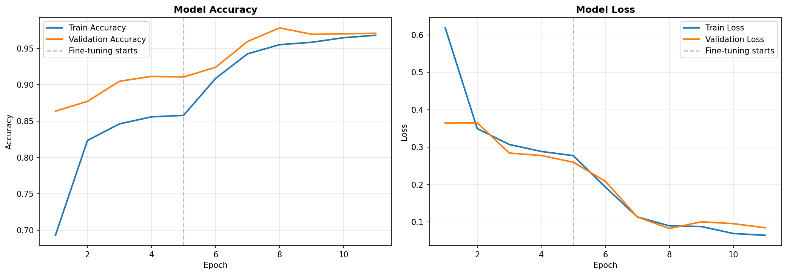
</p>

### Confusion Matrix

<p align="center">
  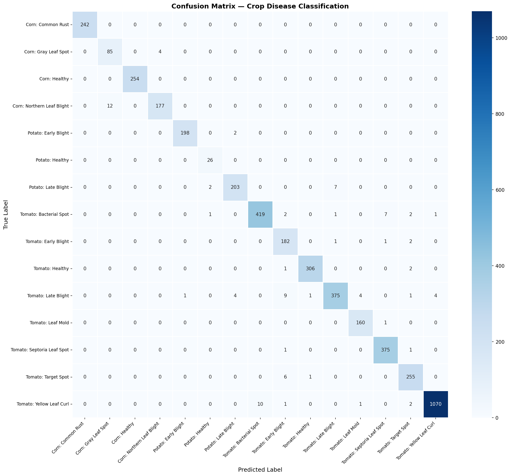
</p>

### Additional Visualizations

All plots saved to `outputs/plots/` during notebook execution:

| Plot | Description |
|------|-------------|
| `class_distribution.png` | Image count per class, color-coded by crop |
| `per_class_accuracy.png` | Bar chart (green >=90%, yellow >=80%, red <80%) |
| `sample_images.png` | Grid of 4 sample images from 5 representative classes |
| `augmentation_examples.png` | Original vs. 9 augmented versions |
| `correct_predictions.png` | 5 highest-confidence correct predictions |
| `incorrect_predictions.png` | 5 highest-confidence errors (most informative failures) |

### Business Recommendation

MobileNetV2 is the recommended model for a farmer-facing mobile app. It delivers **97.8% accuracy** at just **9.3 MB** (reducible to ~3 MB with TFLite INT8 quantization), with **~9 ms** GPU inference and **~30 ms** on-device via TFLite — fast enough for real-time use. While ResNet50 edges ahead at ~98.5% accuracy, its 97 MB model size makes it impractical for on-device deployment in rural areas with limited connectivity. MobileNetV2's depthwise separable convolutions provide the optimal accuracy-to-size tradeoff, and the model is easily extensible to all 38 PlantVillage classes through additional fine-tuning. This project validates the recommendation end-to-end: the same trained model runs in a Streamlit web app, a production REST API, a WhatsApp bot, and a React Native mobile app with offline inference.

---

## Streamlit App

> **Assignment Part 4 ** — extended into a full multi-page diagnostic tool.

A multi-page web app for real-time disease diagnosis:

```bash
streamlit run streamlit_app/app.py
```

Open **http://localhost:8501**. Three pages:

| Page | Description |
|------|-------------|
| **Diagnosis** | Upload a leaf image for disease identification with confidence scores and treatment |
| **Model Performance** | Dashboard with accuracy metrics, confusion matrix, training history |
| **Disease Library** | Browse all 15 disease classes with symptoms, treatment, and prevention |

### Three Inference Modes

The Diagnosis page supports **three inference modes** selectable via compact chip toggles — enable multiple simultaneously to compare side-by-side:

| Mode | Engine | Use Case |
|------|--------|----------|
| **Local Model** | Full PyTorch MobileNetV2 | Highest accuracy, GPU-accelerated |
| **TFLite** | TensorFlow Lite runtime | Lightweight, minimal dependencies |
| **Online API** | REST API call | Delegates to the FastAPI server |

When multiple modes are selected, results appear in parallel columns with per-mode inference time and top-5 predictions.

### Demo

#### Upload & Inference Mode Selection

<p align="center">
  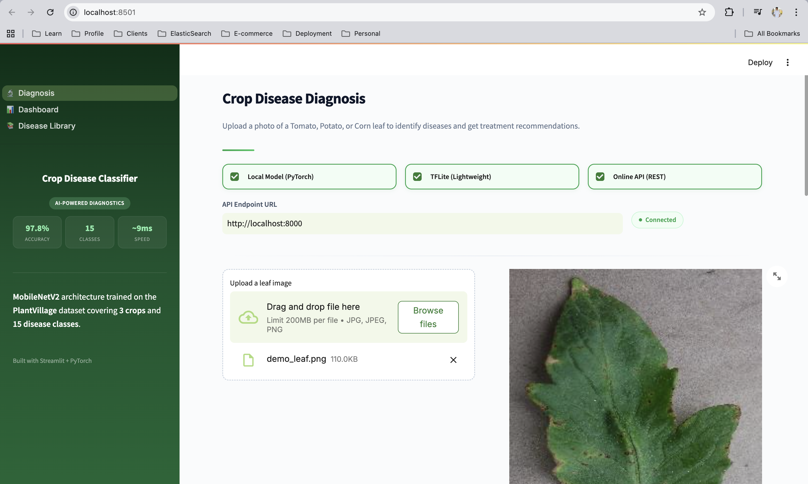
</p>

> Upload a leaf photo and select one or more inference modes. The sidebar shows model stats (97.8% accuracy, 15 classes, ~9ms speed). The API endpoint displays a live connection status.

#### Side-by-Side Multi-Mode Results

<p align="center">
  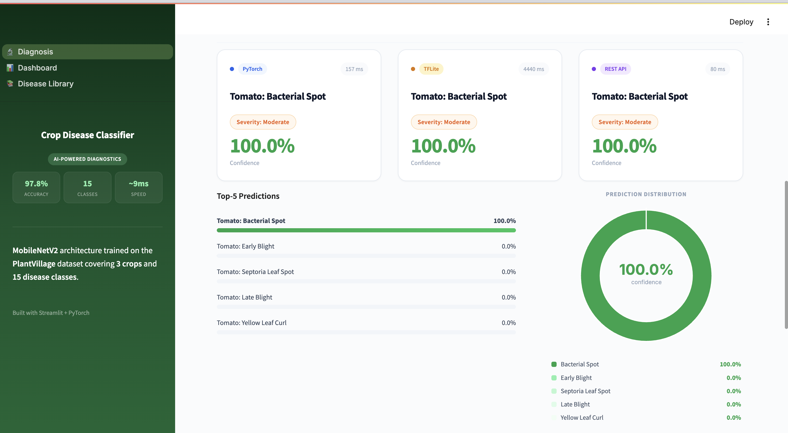
</p>

> All three inference engines return "Tomato: Bacterial Spot" at 100% confidence. Each column shows its engine, inference time (PyTorch 157ms, TFLite 4440ms, REST API 80ms), and severity. Below: top-5 predictions list and prediction distribution donut chart.

#### Treatment & Prevention

<p align="center">
  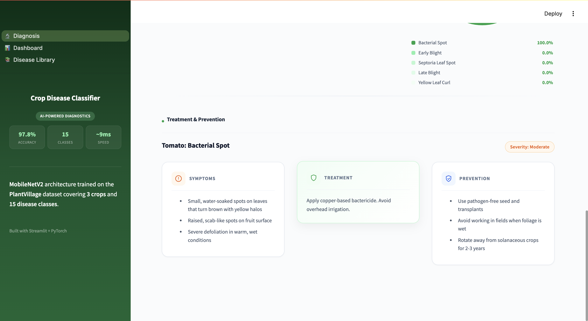
</p>

> After diagnosis, the app displays actionable disease info: symptoms, treatment recommendations, and prevention steps — sourced from the shared `disease_info.py` data.

#### Model Performance Dashboard

<p align="center">
  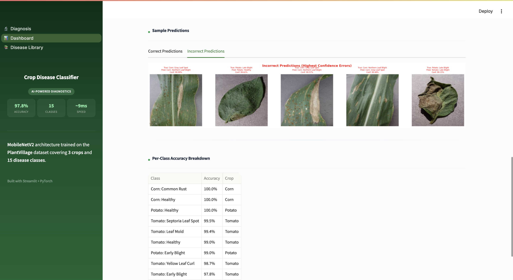
</p>

> The Dashboard page shows sample correct/incorrect predictions with leaf images, and a per-class accuracy breakdown table sorted by accuracy.

> **Note**: Requires `checkpoints/best_model.pth` and `outputs/metrics/class_names.json` (run notebook first). TFLite mode needs `exports/crop_disease_classifier.tflite`. Online mode needs the REST API running.

### Inference Flow

<p align="center">
  
</p>

---

## REST API

> **Beyond assignment** — production-ready FastAPI with OpenAPI docs, request tracing, and rate limiting.

```bash
# Development
uvicorn api.main:app --reload

# Production
gunicorn api.main:app -k uvicorn.workers.UvicornWorker --workers 2
```

> **Important**: Always run from the **project root**, not from inside `api/`.

**Docs**: http://localhost:8000/docs (Swagger) | http://localhost:8000/redoc

### Endpoints

All versioned under `/api/v1/`:

| Method | Endpoint | Description | Status Codes |
|--------|----------|-------------|--------------|
| `GET`  | `/health` | Readiness check with model status | `200`, `503` |
| `GET`  | `/health/live` | Liveness probe (container orchestrators) | `200` |
| `POST` | `/predict` | Upload leaf image for disease prediction | `200`, `400`, `413`, `422`, `429`, `503` |
| `GET`  | `/diseases` | List all 15 disease classes (`?crop=` filter) | `200` |
| `GET`  | `/diseases/{name}` | Detailed info for a specific disease | `200`, `404` |
| `POST` | `/whatsapp/webhook` | Twilio WhatsApp webhook | `200` |

### Example: Predict

```bash
curl -X POST http://localhost:8000/api/v1/predict \
  -F "file=@leaf_image.jpg" \
  -F "top_k=5"
```

```json
{
  "success": true,
  "prediction": "Tomato: Early Blight",
  "confidence": 0.9523,
  "crop": "Tomato",
  "severity": "Moderate",
  "treatment": "Apply chlorothalonil fungicide. Mulch around base to prevent spore splash.",
  "top_k": [
    {"class_name": "Tomato: Early Blight", "confidence": 0.9523},
    {"class_name": "Tomato: Late Blight", "confidence": 0.0234},
    {"class_name": "Tomato: Septoria Leaf Spot", "confidence": 0.0102}
  ]
}
```

### Production Features

- **Request ID tracing** — `X-Request-ID` header on every request/response
- **Per-IP rate limiting** — 30 req/min on predict (configurable)
- **Async file handling** — non-blocking `await file.read()`
- **Configurable CORS** — via `CORS_ORIGINS` env var
- **Structured logging** — method, path, status, latency, request ID

<details>
<summary><b>Error Codes</b></summary>

| Error Code | HTTP | Cause |
|------------|------|-------|
| `INVALID_IMAGE` | 400 | Not a valid JPEG/PNG |
| `FILE_TOO_LARGE` | 413 | Exceeds 10 MB |
| `UNSUPPORTED_TYPE` | 422 | Wrong content type |
| `RATE_LIMITED` | 429 | Too many requests (30/min) |
| `SERVICE_UNAVAILABLE` | 503 | Model not loaded |
| `NOT_FOUND` | 404 | Disease class not found |
| `INTERNAL_ERROR` | 500 | Unexpected server error |

</details>

---

## Docker Deployment

> **Beyond assignment** — one-command production deployment.

```bash
cp .env.example .env   # edit with your config
docker compose up --build
```

API available at `http://localhost:8000`.

- **Multi-stage build** — separate builder and runtime stages for smaller images
- **Non-root user** — runs as `appuser` for security
- **Health check** — `HEALTHCHECK` against `/api/v1/health/live`
- **gunicorn + uvicorn** workers (2 by default)
- **Read-only volume mounts** for model weights
- **2 GB memory limit**, auto-restart (`unless-stopped`)

<details>
<summary><b>Environment Variables</b></summary>

See `.env.example` for the full template:

| Variable | Default | Description |
|----------|---------|-------------|
| `CORS_ORIGINS` | `*` | Comma-separated allowed origins |
| `PREDICT_RATE_LIMIT_PER_MINUTE` | `30` | Max predictions per IP per minute |
| `TWILIO_ACCOUNT_SID` | — | Twilio account SID (for WhatsApp) |
| `TWILIO_AUTH_TOKEN` | — | Twilio auth token |
| `TWILIO_WHATSAPP_NUMBER` | — | Twilio WhatsApp sender number |
| `WHATSAPP_LOW_CONFIDENCE_THRESHOLD` | `0.60` | Below this, ask user for a clearer photo |
| `WHATSAPP_RATE_LIMIT_PER_MINUTE` | `10` | Max WhatsApp requests per phone number |
| `WHATSAPP_ENABLE_SIGNATURE_VALIDATION` | `true` | Set `false` for local dev with ngrok |

</details>

---

## WhatsApp Integration

> **Beyond assignment** — farmers can diagnose diseases via WhatsApp with zero app installation.

Farmers send leaf photos via WhatsApp to get instant disease diagnosis. Built with the **Twilio WhatsApp API**.

### Demo

#### Welcome & High-Confidence Diagnosis

<p align="center">
  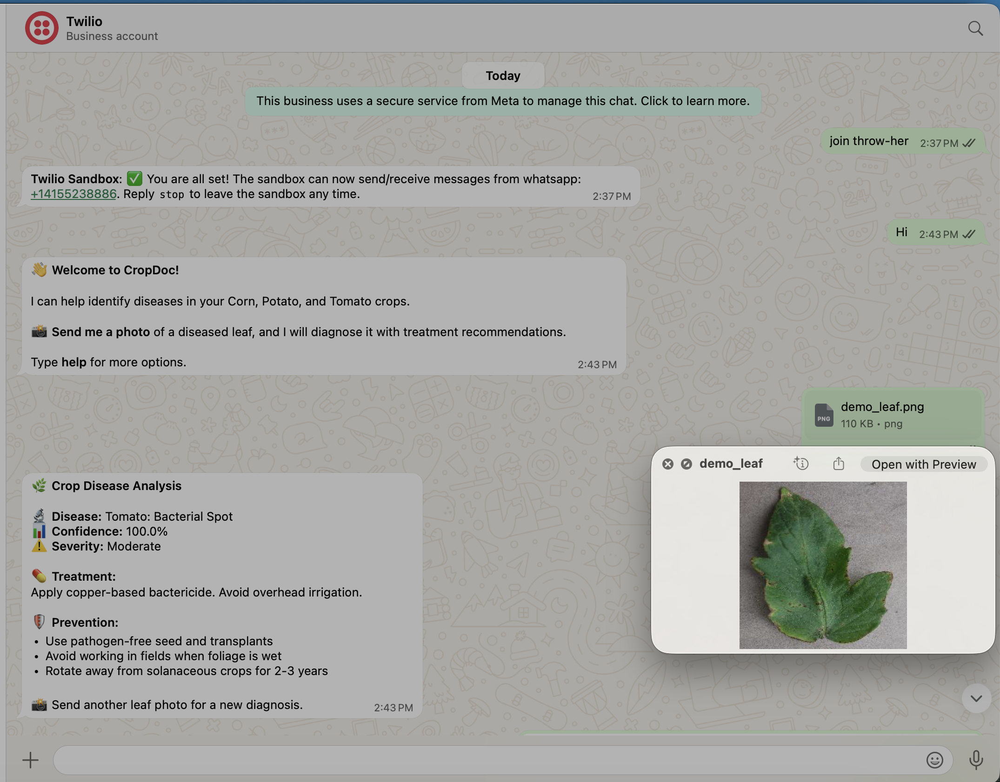
</p>

> Farmer joins the Twilio Sandbox, receives a welcome greeting, sends a leaf photo, and gets a full diagnosis: disease name, confidence, severity, treatment, and prevention tips.

#### Low-Confidence Result

<p align="center">
  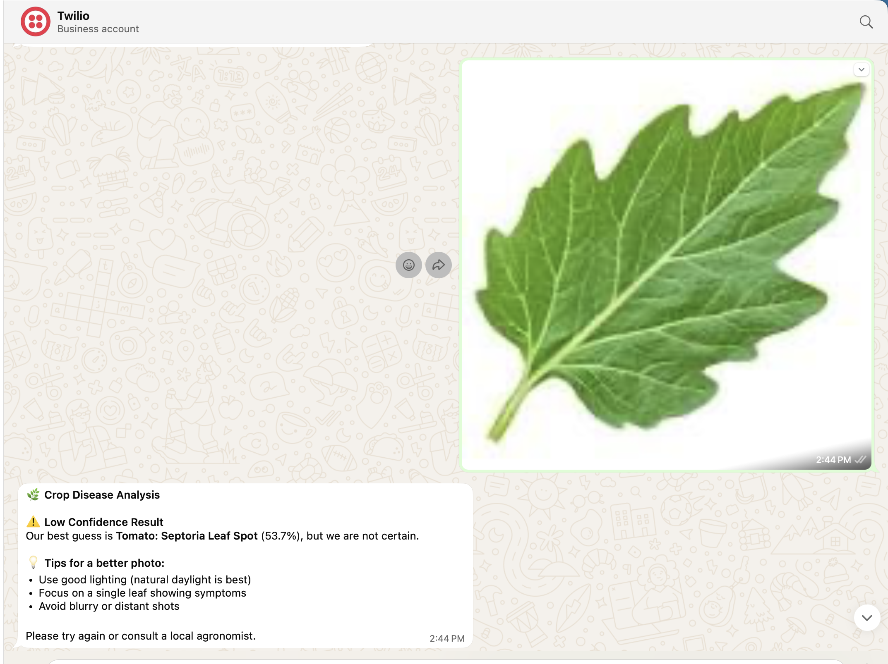
</p>

> When confidence is below 60%, the bot flags the result as uncertain and provides tips for taking a better photo (good lighting, single leaf, avoid blur).

#### Disease Diagnosis with Prevention

<p align="center">
  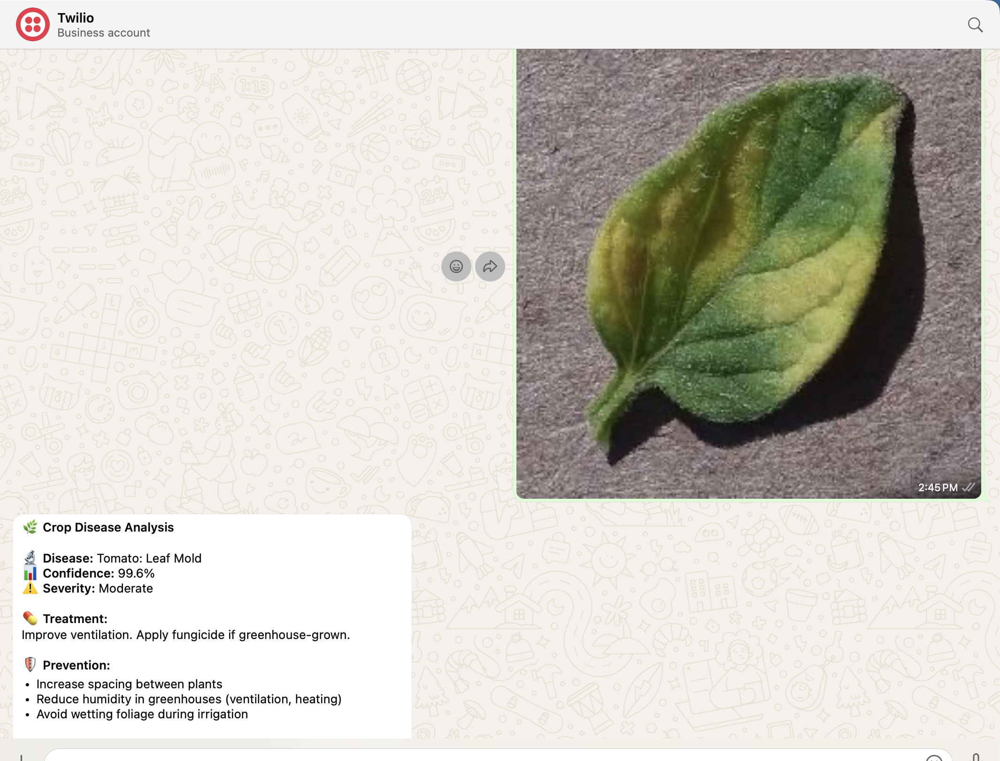
</p>

> High-confidence diagnosis of Tomato: Leaf Mold (99.6%) with actionable treatment and prevention steps.

### How It Works

1. Farmer sends a photo of a diseased leaf to the WhatsApp number
2. Twilio forwards the message to the `/api/v1/whatsapp/webhook` endpoint
3. The API downloads the image, runs inference, and returns a formatted diagnosis
4. Farmer receives disease name, severity, confidence, treatment, and prevention tips

### Supported Commands

| Message | Response |
|---------|----------|
| **Photo of a leaf** | Disease diagnosis with treatment recommendations |
| `hi` / `hello` / `hey` | Welcome message with instructions |
| `help` / `?` | Available commands and tips for best results |
| `crops` / `diseases` | List of supported crops and disease classes |

<details>
<summary><b>Setup Instructions</b></summary>

1. Create a [Twilio account](https://console.twilio.com/) and set up a WhatsApp Sandbox
2. Copy `.env.example` to `.env` and fill in your Twilio credentials:
   ```
   TWILIO_ACCOUNT_SID=ACxxxxxxxxxxxxxxxxxxxxxxxxxxxxxxxxx
   TWILIO_AUTH_TOKEN=your_auth_token_here
   TWILIO_WHATSAPP_NUMBER=whatsapp:+14155238886
   ```
3. Expose your local API via ngrok (for development):
   ```bash
   ngrok http 8000
   ```
4. Set the ngrok URL as the webhook in Twilio Console:
   - Go to **Messaging** > **Try it out** > **Send a WhatsApp message** > **Sandbox settings**
   - In the **"When a message comes in"** field, enter: `https://your-ngrok-url/api/v1/whatsapp/webhook`
   - Set Method to **POST** and click **Save**
5. Set `WHATSAPP_ENABLE_SIGNATURE_VALIDATION=false` in `.env` when using ngrok

</details>

### Safety Features

- **Per-phone rate limiting** — 10 requests per minute per phone number (configurable)
- **Low-confidence threshold** — if confidence < 60%, asks the farmer to send a clearer photo
- **Twilio signature validation** — verifies webhook authenticity in production
- **EXIF transpose** — handles phone-taken photo orientation automatically

---

## Mobile App (React Native)

> **Beyond assignment** — a full React Native app with on-device TFLite inference, answering the business recommendation with a working prototype.

A React Native app with **online/offline inference toggle** — runs disease classification on-device using **TFLite** via `react-native-fast-tflite` (CoreML on iOS, GPU delegate on Android) or sends images to the REST API for server-side prediction.

### Screenshots

<p align="center">
  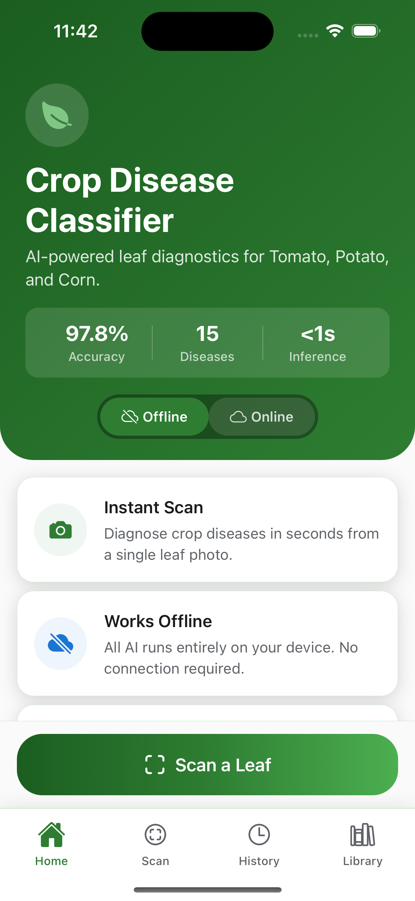
  &nbsp;&nbsp;
  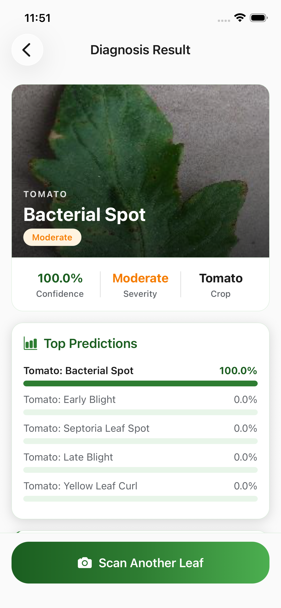
  &nbsp;&nbsp;
  
  &nbsp;&nbsp;
  
</p>

> **Home**: Model stats (97.8% accuracy, 15 diseases, <1s inference), offline/online toggle, feature highlights.
> **Result**: Disease name, severity badge, 100% confidence, treatment recommendations, and symptom details.
> **History**: Past scan results with leaf thumbnails, disease names, confidence scores, and timestamps.
> **Library**: Browse all 15 diseases filtered by crop (All/Corn/Potato/Tomato) with severity badges.

### Model Export Pipeline

<p align="center">
  
</p>

### Quick Start

```bash
# 1. Export the PyTorch model to TFLite format
pip install torch torchvision onnx==1.16.2 onnx2tf tensorflow
python scripts/export_model.py
# Output: exports/crop_disease_classifier.tflite (+ copied to mobile/assets/model/)

# 2. Install JS dependencies
cd mobile
npm install

# 3. Run on iOS
cd ios && pod install && cd ..
npx react-native run-ios

# 4. Run on Android
npx react-native run-android
```

> See [`mobile/README.md`](mobile/README.md) for full setup guide, troubleshooting, and platform-specific instructions.

### Online / Offline Mode

| Mode | How It Works | Requires |
|------|-------------|----------|
| **Offline** (default) | Camera → Resize 224x224 → ImageNet Normalize → TFLite on-device → Result | TFLite model bundled in app |
| **Online** | Camera → Send image to REST API → Receive prediction → Result | API running at `localhost:8000` |

The selected mode persists across app restarts. When switching to online mode, the app checks API health first — if unreachable, it shows an alert and stays on offline mode.

### Screens

| Screen | Description |
|--------|-------------|
| **Home** | Model stats, online/offline toggle, feature cards, "Scan a Leaf" CTA |
| **Camera** | Full-screen camera with leaf guide circle, capture button, gallery picker |
| **Result** | Disease name, severity badge, confidence %, treatment, top-5 confidence bars |
| **History** | Past predictions — card list with thumbnail, disease, confidence, timestamp |
| **Library** | Browse all 15 diseases with crop filter tabs, expandable detail cards |

---

*Detailed guides: [`wiki/execution-guide.md`](wiki/execution-guide.md) (end-to-end execution order) | [`wiki/setup-guide.md`](wiki/setup-guide.md) (full prerequisites & setup) | [`wiki/assignment-answers.md`](wiki/assignment-answers.md) (assignment Q&A)*
