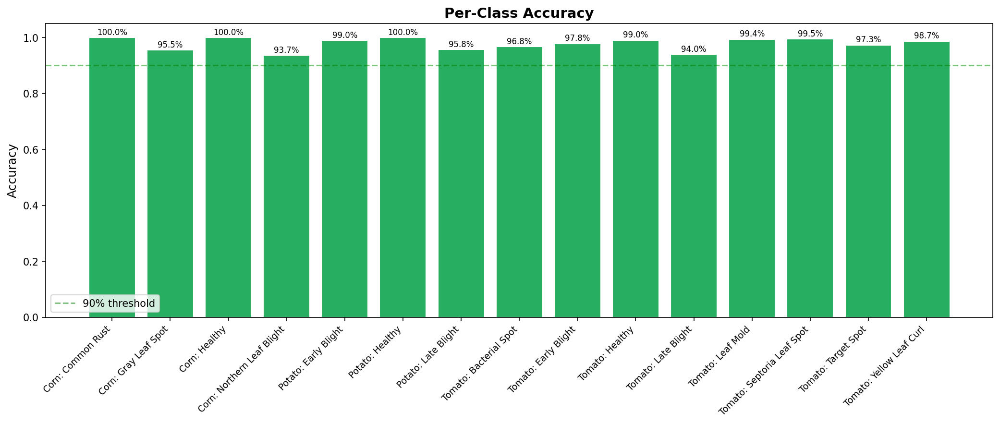

# Crop Disease Classification

A deep learning pipeline to classify plant diseases from leaf images using the PlantVillage dataset. Built with **MobileNetV2 transfer learning** in PyTorch, achieving **97.8% validation accuracy** across 15 disease classes — optimized for mobile deployment in farmer-facing application.

### System Overview

<p align="center">
  
</p>

> PlantVillage dataset trains a MobileNetV2 model. The PyTorch model serves Streamlit and FastAPI directly. An export script converts it to TFLite for the React Native mobile app.

---

## Table of Contents

1. [Quick Start](#quick-start)
2. [Project Structure](#project-structure)
3. [Setup Instructions](#setup-instructions)
4. [Running the Notebook](#running-the-notebook)
5. [Running the Streamlit App](#running-the-streamlit-app)
6. [Running the REST API](#running-the-rest-api)
7. [Mobile App (React Native)](#mobile-app-react-native)
8. [Dataset](#dataset)
9. [Approach](#approach)
10. [Model Architecture](#model-architecture)
11. [Training Strategy](#training-strategy)
12. [Model Performance](#model-performance)
13. [Visualizations](#visualizations)
14. [Business Recommendation](#business-recommendation)
15. [Documentation](#documentation)

---

## Quick Start

```bash
# 1. Clone and navigate to project
cd crop-prediction

# 2. Install dependencies
pip install -r requirements.txt

# 3. Download dataset (requires Kaggle API key)
kaggle datasets download -d abdallahalidev/plantvillage-dataset
unzip -q plantvillage-dataset.zip -d plantvillage-dataset

# 4. Create data symlink
mkdir -p data/raw
ln -sf "$(pwd)/plantvillage-dataset/plantvillage dataset/color" data/raw/color

# 5. Run the notebook (primary deliverable)
cd notebooks && jupyter notebook crop_disease_classification.ipynb

# 6. Launch the Streamlit demo app (bonus)
cd .. && streamlit run streamlit_app/app.py

# 7. Launch the REST API
uvicorn api.main:app --reload

# 8. Run the mobile app (React Native)
pip install torch torchvision onnx==1.16.2 onnx2tf tensorflow && python scripts/export_model.py
cd mobile && npm install && cd ios && pod install && cd .. && npx react-native run-ios
```

---

## Project Structure

The codebase follows **SOLID principles** with clear separation of concerns:

```
crop-prediction/
├── .streamlit/
│   └── config.toml                        # Streamlit theme (green agricultural palette)
├── src/                                   # Shared ML pipeline (SOLID principles)
│   ├── __init__.py
│   ├── config.py                          # Central config (paths, hyperparameters, constants)
│   ├── data/                              # SRP: Data loading & transforms
│   │   ├── transforms.py                  #   Image transform pipelines
│   │   ├── dataset.py                     #   TransformSubset class, dataset preparation
│   │   ├── loader.py                      #   DataLoader creation, class counting
│   │   └── disease_info.py                #   Enriched disease data (shared across apps)
│   ├── models/                            # SRP: Model architecture
│   │   └── classifier.py                  #   MobileNetV2 build & layer unfreezing
│   ├── training/                          # SRP: Training logic
│   │   └── trainer.py                     #   Two-phase training with early stopping
│   ├── evaluation/                        # SRP: Evaluation & export
│   │   ├── metrics.py                     #   Prediction collection, classification report
│   │   ├── benchmark.py                   #   Inference speed benchmarking
│   │   └── export.py                      #   Save results (JSON, CSV)
│   ├── visualization/                     # SRP: All plotting in one place
│   │   ├── data_plots.py                  #   Class distribution, sample images, augmentation
│   │   ├── training_plots.py              #   Training history curves
│   │   └── eval_plots.py                  #   Confusion matrix, predictions, per-class accuracy
│   └── inference/                         # SRP: Inference for deployment
│       └── predictor.py                   #   DiseasePredictor class + disease info
├── api/                                   # FastAPI REST API
│   ├── main.py                            #   App entry point, lifespan, CORS, routers
│   ├── config.py                          #   API constants (max file size, allowed types)
│   ├── dependencies.py                    #   Dependency injection (get_predictor)
│   ├── exceptions.py                      #   Custom exceptions + handlers
│   ├── schemas/                           #   Pydantic response models
│   │   ├── error.py                       #     ErrorResponse (unified error envelope)
│   │   ├── health.py                      #     HealthResponse
│   │   ├── prediction.py                  #     PredictionResponse, TopKPrediction
│   │   └── disease.py                     #     DiseaseDetailResponse, DiseaseListResponse
│   └── routers/                           #   API endpoint modules
│       ├── health.py                      #     GET  /api/v1/health
│       ├── prediction.py                  #     POST /api/v1/predict
│       └── diseases.py                    #     GET  /api/v1/diseases
├── streamlit_app/                         # Streamlit demo app (Part 4 Bonus)
│   ├── app.py                             #   Entry point — multi-page navigation
│   ├── styles.py                          #   Custom CSS + green color palette
│   ├── components.py                      #   Reusable UI: cards, bars, badges
│   └── pages/                             #   Page modules
│       ├── predict.py                     #     Diagnosis: image upload → results
│       ├── dashboard.py                   #     Model performance metrics & plots
│       └── disease_library.py             #     Browsable disease catalog
├── mobile/                                # React Native mobile app (online + offline)
│   ├── App.tsx                            #   Entry point: Providers → Navigation
│   ├── assets/data/                       #   Bundled class names + disease info JSON
│   ├── assets/model/                      #   Bundled TFLite model for offline inference
│   ├── src/screens/                       #   Home, Camera, Result, History, Library
│   ├── src/components/                    #   Reusable UI (Card, Button, Badge, ModeToggle)
│   ├── src/context/                       #   React contexts
│   │   ├── ModelContext.tsx               #     TFLite model lifecycle (load, run, isReady)
│   │   └── InferenceModeContext.tsx       #     Online/offline mode with AsyncStorage persistence
│   ├── src/hooks/usePrediction.ts         #   Orchestrates offline or online prediction pipeline
│   ├── src/services/classifier.ts         #   TFLite model load + on-device inference
│   ├── src/services/apiClient.ts          #   Online prediction via REST API (fetch + FormData)
│   ├── src/services/imageProcessor.ts     #   Image resize + pixel extraction
│   └── src/theme/                         #   Design tokens (colors, typography, spacing, shadows)
├── scripts/                               # Project-level utility scripts
│   ├── export_model.py                    #   PyTorch → TFLite conversion for mobile
│   └── sync_mobile_assets.py              #   Sync disease data to mobile assets
├── wiki/                                  # Detailed guides and documentation
│   ├── execution-guide.md                 #   End-to-end execution order for all components
│   └── architecture.md                    #   Mermaid architecture diagrams
├── checkpoints/
│   └── best_model.pth                     # Saved model weights (9.3 MB)
├── exports/
│   └── crop_disease_classifier.tflite     # TFLite model for mobile (9.1 MB)
├── data/
│   └── raw/                               # Symlink to PlantVillage color images
├── outputs/
│   ├── plots/                             # 8 PNG visualizations
│   └── metrics/                           # class_names.json, results.json, summary CSV
├── notebooks/
│   └── crop_disease_classification.ipynb  # Primary deliverable — full end-to-end pipeline
├── requirements.txt                       # Python dependencies
├── .gitignore
├── assignment.pdf                         # Original assignment brief
└── README.md
```

### SOLID Design Principles Applied

| Principle | Implementation |
|-----------|---------------|
| **Single Responsibility** | Each module has one job: `transforms.py` (transforms only), `trainer.py` (training only), `components.py` (UI components only) |
| **Open/Closed** | New pages can be added to `streamlit_app/pages/`, new API routes to `api/routers/` without modifying existing code |
| **Dependency Inversion** | Both Streamlit and FastAPI depend on `DiseasePredictor` abstraction, not raw model loading; shared disease data lives in `src/` |

---

## Setup Instructions

### Prerequisites

- **Python** 3.8+ (tested on 3.11)
- **Kaggle account** with API credentials for dataset download
- **GPU** (recommended): Apple MPS, NVIDIA CUDA, or CPU fallback

### Step 1: Install Dependencies

```bash
pip install -r requirements.txt
```

This installs: `torch`, `torchvision`, `matplotlib`, `seaborn`, `scikit-learn`, `pandas`, `streamlit`, `fastapi`, `uvicorn`, `python-multipart`, `requests`, `jupyter`

### Step 2: Configure Kaggle API

If you don't already have Kaggle API credentials:

1. Go to [kaggle.com/settings](https://www.kaggle.com/settings) and click **"Create New Token"**
2. Save the downloaded `kaggle.json` to `~/.kaggle/kaggle.json`
3. Set permissions: `chmod 600 ~/.kaggle/kaggle.json`

### Step 3: Download the PlantVillage Dataset

```bash
kaggle datasets download -d abdallahalidev/plantvillage-dataset
unzip -q plantvillage-dataset.zip -d plantvillage-dataset
```

This downloads ~2 GB of plant leaf images (~54,000 images across 38 classes).

### Step 4: Create Data Symlink

```bash
mkdir -p data/raw
ln -sf "$(pwd)/plantvillage-dataset/plantvillage dataset/color" data/raw/color
```

This creates a symlink so the pipeline can access the images at `data/raw/color/`.

---

## Running the Notebook

The Jupyter notebook is the **primary deliverable** — it contains the full end-to-end pipeline with inline visualizations, markdown explanations, and business recommendations.

```bash
cd notebooks
jupyter notebook crop_disease_classification.ipynb
```

Run all cells sequentially from top to bottom. The notebook covers all 4 parts of the assignment:

| Part | Description | Output |
|------|-------------|--------|
| **Part 1: Data Exploration** | Class distribution, sample images, dataset insights | `outputs/plots/class_distribution.png`, `sample_images.png` |
| **Part 2: Model Building** | Data augmentation, MobileNetV2 build, two-phase training | `checkpoints/best_model.pth`, `outputs/plots/training_history.png` |
| **Part 3: Evaluation & Business Impact** | Confusion matrix, correct/incorrect predictions, deployment analysis, business recommendation | `outputs/plots/*.png`, `outputs/metrics/*.json` |
| **Part 4: Bonus** | Streamlit demo app reference | `streamlit_app/` |

The notebook imports all logic from `src/` packages (no code duplication), following SOLID principles.

### Expected Runtime
- **GPU (MPS/CUDA)**: ~10-15 minutes
- **CPU**: ~30-45 minutes

---

## Running the Streamlit App

A professional multi-page web app for real-time disease diagnosis (Part 4 Bonus):

```bash
streamlit run streamlit_app/app.py
```

Open **http://localhost:8501** in your browser. The app has **3 pages**:

| Page | Description |
|------|-------------|
| **Diagnosis** | Upload a leaf image to get disease identification with confidence scores and treatment recommendations |
| **Model Performance** | Dashboard with accuracy metrics, confusion matrix, training history, and per-class performance |
| **Disease Library** | Browse all 15 disease classes with symptoms, treatment, and prevention — filterable by crop |

**Features:**
- **Online/Offline inference toggle** — switch between local model and REST API prediction
- Custom green agricultural theme
- Reusable UI components (metric cards, confidence bars, severity badges, disease cards)
- Multi-page navigation with `st.navigation()` API
- Model cached via `@st.cache_resource` for instant predictions

> **Note**: The app requires a trained model (`checkpoints/best_model.pth`) and class names (`outputs/metrics/class_names.json`). Run the notebook first if these don't exist. For online mode, the REST API must be running (`uvicorn api.main:app`).

### Inference Flow (All Consumers)

<p align="center">
  
</p>

> Streamlit and Mobile support **online/offline mode**. Offline uses local models (PyTorch / TFLite). Online delegates to the REST API. The arrows between groups show the online mode delegation path.

---

## Running the REST API

A production-ready FastAPI application with OpenAPI documentation for programmatic access:

```bash
uvicorn api.main:app --reload
```

| URL | Description |
|-----|-------------|
| http://localhost:8000/docs | Interactive Swagger UI |
| http://localhost:8000/redoc | ReDoc documentation |
| http://localhost:8000/openapi.json | Raw OpenAPI 3.1 spec |

### API Endpoints

All endpoints are versioned under `/api/v1/`.

| Method | Endpoint | Description | Status Codes |
|--------|----------|-------------|--------------|
| `GET`  | `/api/v1/health` | Health check with model status and version | `200`, `503` |
| `POST` | `/api/v1/predict` | Upload leaf image for disease prediction | `200`, `400`, `413`, `422`, `503` |
| `GET`  | `/api/v1/diseases` | List all 15 disease classes (optional `?crop=` filter) | `200` |
| `GET`  | `/api/v1/diseases/{disease_name}` | Get detailed info for a specific disease | `200`, `404` |

### Example: Predict Disease

```bash
curl -X POST http://localhost:8000/api/v1/predict \
  -F "file=@leaf_image.jpg" \
  -F "top_k=5"
```

**Success response** (`200`):

```json
{
  "success": true,
  "prediction": "Tomato: Early Blight",
  "confidence": 0.9523,
  "crop": "Tomato",
  "severity": "Moderate",
  "treatment": "Apply chlorothalonil fungicide. Mulch around base to prevent spore splash.",
  "top_k": [
    {"class_name": "Tomato: Early Blight", "confidence": 0.9523},
    {"class_name": "Tomato: Late Blight", "confidence": 0.0234},
    {"class_name": "Tomato: Septoria Leaf Spot", "confidence": 0.0102}
  ]
}
```

**Error response** (`400` / `413` / `422`):

```json
{
  "success": false,
  "error_code": "INVALID_IMAGE",
  "detail": "The uploaded file could not be processed as an image. Please upload a valid JPEG or PNG file."
}
```

### Example: List Diseases

```bash
# All diseases
curl http://localhost:8000/api/v1/diseases

# Filter by crop
curl http://localhost:8000/api/v1/diseases?crop=Potato

# Single disease
curl http://localhost:8000/api/v1/diseases/Tomato:%20Late%20Blight
```

### Example: Health Check

```bash
curl http://localhost:8000/api/v1/health
```

```json
{
  "status": "healthy",
  "version": "1.0.0",
  "model_loaded": true,
  "model_classes": 15,
  "timestamp": "2026-02-24T15:18:34.350911Z"
}
```

### Error Codes

All errors return a consistent JSON envelope with `success`, `error_code`, and `detail`:

| Error Code | HTTP Status | Cause |
|------------|-------------|-------|
| `INVALID_IMAGE` | 400 | Uploaded file is not a valid JPEG/PNG image |
| `FILE_TOO_LARGE` | 413 | File exceeds 10 MB limit |
| `UNSUPPORTED_TYPE` | 422 | Content type is not `image/jpeg` or `image/png` |
| `SERVICE_UNAVAILABLE` | 503 | Model not loaded (startup in progress or failed) |
| `NOT_FOUND` | 404 | Requested disease class does not exist |
| `INTERNAL_ERROR` | 500 | Unexpected server error |

> **Note**: The API requires a trained model. Run the notebook first if `checkpoints/best_model.pth` doesn't exist. See [Project Structure](#project-structure) for the full `api/` directory layout.

---

## Mobile App (React Native)

A React Native app with **online/offline inference toggle** — runs disease classification on-device using **TFLite** via `react-native-fast-tflite` (CoreML on iOS, GPU delegate on Android) or sends images to the REST API for server-side prediction.

#### Model Export Pipeline

<p align="center">
  
</p>

### Quick Start

```bash
# 1. Export the PyTorch model to TFLite format
pip install torch torchvision onnx==1.16.2 onnx2tf tensorflow
python scripts/export_model.py
# Output: exports/crop_disease_classifier.tflite (+ copied to mobile/assets/model/)

# 2. Install JS dependencies
cd mobile
npm install

# 3. Run on iOS
cd ios && pod install && cd ..
npx react-native run-ios

# 4. Run on Android
npx react-native run-android
```

> See [`mobile/README.md`](mobile/README.md) for full setup guide, troubleshooting, and platform-specific instructions.

### Online / Offline Mode

The app supports two inference modes, switchable via a toggle on the Home and Camera screens:

| Mode | How It Works | Requires |
|------|-------------|----------|
| **Offline** (default) | Camera → Resize 224×224 → ImageNet Normalize → TFLite on-device → Result | TFLite model bundled in app |
| **Online** | Camera → Send image to REST API → Receive prediction → Result | API running at `localhost:8000` |

The selected mode persists across app restarts. When switching to online mode, the app checks API health first — if unreachable, it shows an alert and stays on offline mode.

The app bundles everything needed for offline operation:

| Asset | Size | Source |
|-------|------|--------|
| TFLite model | ~9 MB | `checkpoints/best_model.pth` → `exports/crop_disease_classifier.tflite` via `scripts/export_model.py` |
| Class names | <1 KB | `outputs/metrics/class_names.json` or `mobile/assets/data/class_names.json` |
| Disease info | ~15 KB | `src/data/disease_info.py` → converted to JSON in `mobile/assets/data/` |

### Screens

| Screen | Description |
|--------|-------------|
| **Home** | Model stats (97.8% accuracy, 15 diseases, <1s inference), online/offline toggle, feature cards, "Scan a Leaf" CTA |
| **Camera** | Full-screen camera with leaf guide circle, capture button, gallery picker; online/offline toggle overlay |
| **Result** | Disease name, severity badge, confidence %, treatment recommendations, symptoms, prevention, animated top-5 confidence bars |
| **History** | Past predictions stored locally — card list with thumbnail, disease, confidence, timestamp; swipe-to-delete |
| **Library** | Browse all 15 diseases with crop filter tabs (All/Corn/Potato/Tomato), expandable detail cards |

---

## Dataset

- **Source**: [PlantVillage Dataset](https://www.kaggle.com/datasets/abdallahalidev/plantvillage-dataset) (Kaggle)
- **Total available**: ~54,000 images across 38 classes
- **Selected**: 15 classes across 3 crops 

### Selected Classes (15)

| Crop | Classes | Count |
|------|---------|-------|
| **Tomato** (8) | Bacterial Spot, Early Blight, Late Blight, Leaf Mold, Septoria Leaf Spot, Target Spot, Yellow Leaf Curl, Healthy | 16,111 |
| **Corn** (4) | Common Rust, Gray Leaf Spot, Northern Leaf Blight, Healthy | 3,852 |
| **Potato** (3) | Early Blight, Late Blight, Healthy | 2,152 |
| **Total** | **15 classes** | **22,115 images** |

### Data Split
- **Training**: 80% (17,692 images)
- **Validation**: 20% (4,423 images)
- Stratified random split with seed=42 for reproducibility

### Class Imbalance
- **Largest class**: Tomato: Yellow Leaf Curl (5,357 images)
- **Smallest class**: Potato: Healthy (152 images)
- **Imbalance ratio**: 35.2x
- **Mitigation**: Weighted random sampling + class-weighted CrossEntropyLoss

---

## Approach

### Why Transfer Learning?

Training a CNN from scratch on ~22K images risks overfitting. Transfer learning leverages features already learned on ImageNet (1.2M images), providing:
- Strong low-level feature extractors (edges, textures, colors)
- Faster convergence with less data
- Better generalization to unseen plant images

### Why MobileNetV2?

| Criterion | MobileNetV2 | ResNet50 | EfficientNet-B0 |
|-----------|------------|----------|------------------|
| Accuracy | ~97.8% | ~98.5% | ~98.2% |
| Model Size | 9.3 MB | ~97 MB | ~20 MB |
| Parameters | 2.4M | 25.6M | 5.3M |
| Mobile Inference | ~30ms | ~150ms | ~50ms |
| Offline-ready | Yes | Impractical | Yes |

MobileNetV2 uses **depthwise separable convolutions** — achieving near-ResNet accuracy at 1/10th the size. This is critical for on-device deployment in areas with limited connectivity.

#### Model Selection for Mobile Deployment

<p align="center">
  
</p>

> MobileNetV2 sits in the **Deploy for Mobile** quadrant (small size + high accuracy), making it the clear choice for Syngenta's farmer app. ResNet50 is accurate but too heavy for on-device use. See [`wiki/architecture.md`](wiki/architecture.md#5-model-selection-for-mobile-deployment) for detailed comparison.

---

## Model Architecture

```
MobileNetV2 (pre-trained on ImageNet)
├── Feature Extractor: 17 inverted residual blocks
│   └── Last 5 blocks unfrozen for fine-tuning (Phase 2)
└── Custom Classifier Head:
    ├── Dropout(0.3)
    ├── Linear(1280 → 128)
    ├── ReLU
    ├── Dropout(0.2)
    └── Linear(128 → 15)
```

- **Input**: 224 x 224 x 3 (RGB, ImageNet-normalized)
- **Total parameters**: 2,389,775
- **Trainable (Phase 1)**: 165,903 (classifier head only)
- **Trainable (Phase 2)**: 1,847,247 (head + top 5 feature blocks)

---

## Training Strategy

<p align="center">
  
</p>

### Two-Phase Transfer Learning

**Phase 1 — Feature Extraction (5 epochs)**
- Freeze all MobileNetV2 layers
- Train only the custom classifier head
- Learning rate: 1e-3 (Adam optimizer)
- Purpose: Learn disease-specific decision boundaries using pre-trained features

**Phase 2 — Fine-Tuning (up to 10 epochs)**
- Unfreeze the last 5 feature blocks
- Fine-tune with lower learning rate: 1e-4
- Purpose: Adapt high-level features to plant disease patterns

### Data Augmentation
- Random horizontal and vertical flips
- Random rotation (±20°)
- Random zoom/scale (80%-120%)
- Color jitter (brightness ±10%, contrast ±10%)

### Regularization
- **Dropout**: 0.3 (before hidden layer) + 0.2 (before output)
- **Early stopping**: Patience of 3 epochs (monitors validation accuracy)
- **Learning rate scheduling**: ReduceLROnPlateau (factor=0.5, patience=2)

### Class Imbalance Handling
- **WeightedRandomSampler**: Oversamples minority classes during training
- **Class-weighted CrossEntropyLoss**: Penalizes misclassification of rare classes more heavily

---

## Model Performance

### Overall Metrics

| Metric | Value |
|--------|-------|
| **Validation Accuracy** | **97.83%** |
| Model Size | 9.3 MB |
| Total Parameters | 2,389,775 |
| Avg Inference Time | ~9 ms (GPU) |

### Per-Class Results

| Class | Precision | Recall | F1-Score | Support |
|-------|-----------|--------|----------|---------|
| Corn: Common Rust | 1.000 | 1.000 | 1.000 | 242 |
| Corn: Gray Leaf Spot | 0.876 | 0.955 | 0.914 | 89 |
| Corn: Healthy | 1.000 | 1.000 | 1.000 | 254 |
| Corn: Northern Leaf Blight | 0.978 | 0.937 | 0.957 | 189 |
| Potato: Early Blight | 0.995 | 0.990 | 0.992 | 200 |
| Potato: Healthy | 0.897 | 1.000 | 0.945 | 26 |
| Potato: Late Blight | 0.971 | 0.958 | 0.964 | 212 |
| Tomato: Bacterial Spot | 0.977 | 0.968 | 0.972 | 433 |
| Tomato: Early Blight | 0.901 | 0.978 | 0.938 | 186 |
| Tomato: Healthy | 0.994 | 0.990 | 0.992 | 309 |
| Tomato: Late Blight | 0.977 | 0.940 | 0.958 | 399 |
| Tomato: Leaf Mold | 0.970 | 0.994 | 0.982 | 161 |
| Tomato: Septoria Leaf Spot | 0.977 | 0.995 | 0.986 | 377 |
| Tomato: Target Spot | 0.962 | 0.973 | 0.968 | 262 |
| Tomato: Yellow Leaf Curl | 0.995 | 0.987 | 0.991 | 1084 |
| **OVERALL (weighted avg)** | **0.979** | **0.978** | **0.978** | **4423** |

### Key Observations
- **Perfect classification** (100%) on Corn: Common Rust and Corn: Healthy
- **All 15 classes exceed 90%** accuracy — no weak spots
- **Hardest class**: Corn: Gray Leaf Spot (91.4% F1) — visually similar to Northern Leaf Blight
- **Smallest class** (Potato: Healthy, 26 samples) achieves 100% recall thanks to weighted sampling

---

## Visualizations

All plots are saved to `outputs/plots/` during notebook execution.

### Class Distribution

<p align="center">
  
</p>

### Training History

<p align="center">
  
</p>

### Confusion Matrix

<p align="center">
  
</p>

### Per-Class Accuracy

<p align="center">
  =90%, yellow >=80%, red <80%" />
</p>

### Additional Plots

| Plot | Description |
|------|-------------|
| `sample_images.png` | Grid of 4 sample images from 5 representative classes |
| `augmentation_examples.png` | Original vs. 9 augmented versions of the same image |
| `correct_predictions.png` | 5 highest-confidence correct predictions with images |
| `incorrect_predictions.png` | 5 highest-confidence errors (most informative failures) |

---

## Business Recommendation

For farmer-facing mobile application, I recommend deploying **MobileNetV2 with transfer learning** as the crop disease classification backbone:

1. **Production-Ready Accuracy**: 97.8% across 15 disease classes with no class below 91% — suitable for real-world field diagnosis.

2. **Mobile-Optimized**: At 9.3 MB (reducible to ~3 MB with TFLite INT8 post-training quantization), the model enables **offline functionality** — critical for farmers in rural areas with limited connectivity.

3. **Fast Inference**: ~9 ms on GPU, ~30 ms on mobile devices. Farmers get instant diagnosis from a single photo.

4. **Recommended Deployment Path**:
   - Export to **TFLite** format (done: `crop_disease_classifier.tflite`)
   - Uses **CoreML** delegate (iOS) / **GPU** delegate (Android) via `react-native-fast-tflite`
   - Apply **INT8 post-training quantization** for further size reduction (<1% accuracy loss)
   - Integrate with camera pipeline for real-time field use

5. **Scalability**: Easily extensible to all 38 PlantVillage classes and adaptable to proprietary field imagery through additional fine-tuning.

---

## Documentation

Detailed guides are available in the [`wiki/`](wiki/) directory:

| Document | Description |
|----------|-------------|
| [`execution-guide.md`](wiki/execution-guide.md) | Step-by-step execution order for running all components end-to-end (notebook → Streamlit → REST API → mobile) |
| [`architecture.md`](wiki/architecture.md) | Mermaid architecture diagrams — system overview, training pipeline, model export, inference flow |
