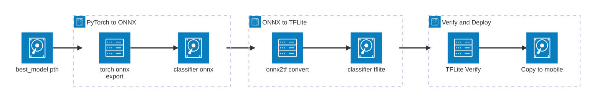

# Architecture Diagrams

Mermaid architecture diagrams for the Crop Disease Classification system.

---

## 1. System Overview

PlantVillage dataset trains a MobileNetV2 model. The PyTorch model (`best_model.pth`) serves Streamlit and FastAPI directly. An export script converts it to TFLite for the React Native mobile app. Streamlit and Mobile support **online/offline mode** — offline uses local models, online delegates to the REST API.

---

## 2. Training Pipeline

Phase 1 trains the classifier head only (5 epochs). Phase 2 fine-tunes top 5 backbone blocks (up to 10 epochs with early stopping).

---

## 3. Model Export Pipeline

Converts PyTorch model to TFLite for on-device mobile inference via ONNX intermediate format. Output goes to `exports/` and is copied to `mobile/assets/model/`.

---

## 4. Inference Flow

Three parallel inference paths. Streamlit and Mobile support **online/offline mode** — offline uses local models, online delegates to the REST API. The online mode arrows show the delegation path to the API group.

---

## 5. Model Selection for Mobile Deployment

**Question:** Which model would you deploy for Syngenta's farmer mobile app? Consider accuracy, speed, and model size.

The quadrant chart plots three candidate models on **Model Size** (x-axis) vs **Accuracy** (y-axis). MobileNetV2 lands in the ideal **Deploy for Mobile** zone — small enough for offline use on low-end farmer devices while maintaining production-grade accuracy.

### Comparison Table

| Metric | MobileNetV2 | EfficientNet B0 | ResNet50 |
|--------|-------------|-----------------|----------|
| **Accuracy** | 97.8% | 98.2% | 98.5% |
| **Model Size** | 9.3 MB | 20 MB | 97 MB |
| **Parameters** | 2.4M | 5.3M | 25.6M |
| **Inference Speed** | ~30 ms | ~50 ms | ~150 ms |
| **Mobile Ready** | Yes (TFLite) | Possible | No |
| **Offline Capable** | Yes | Marginal | No |

### Why MobileNetV2?

- **9.3 MB** fits on low-storage farmer devices and downloads over slow rural networks
- **~30 ms** inference enables real-time field scanning without lag
- **97.8% accuracy** is only 0.7% behind ResNet50 — negligible in practice
- **TFLite export** with CoreML/GPU delegate support for on-device inference
- **No internet required** — critical for rural areas with poor connectivity
